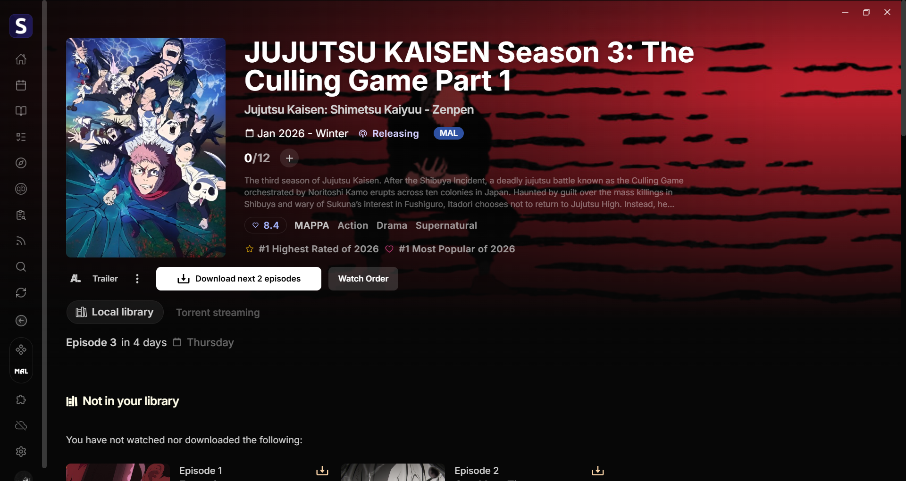
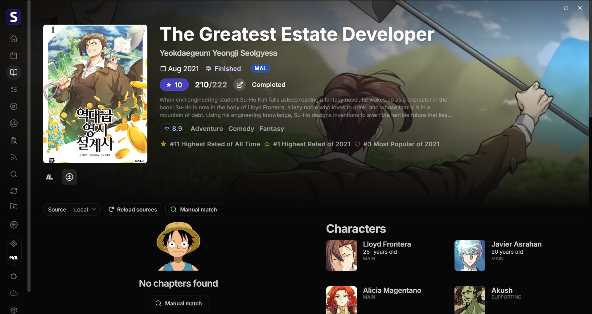

# MAL Button - Seanime Plugin

<div align="center">
  
  <h3>🚀 Quick MyAnimeList Access for Seanime</h3>
  <p>Native-style "Blue Pill" button for Anime & Manga pages</p>

[](LICENSE)

[](https://github.com/5rahim/seanime)
</div>

---

## 📋 Features

✅ **Native Integration** - Injects a "Blue Pill" style button directly into the Seanime header metadata area.  
✅ **Anime & Manga Support** - Automatically detects and generates correct links for both media types (`/anime/` vs `/manga/`).  
✅ **Smart Logic** - Handles race conditions and duplication to ensure the button always matches the current page.  
✅ **Robust** - Uses `ctx.dom` and `ctx.anime`/`ctx.manga` APIs with graceful fallbacks.  

---

## 🖼️ Previews

<div align="center">
  
  
</div>

---

## 🎯 How to Use

### Installation

1. **Open Seanime Extensions**
2. **Install "MAL Button"** from the marketplace.
3. **Restart Seanime** (Important for the DOM scripts to initialize cleanly).

### Usage

1. **Navigate to any Anime or Manga page.**
2. Look at the header (next to the date/metadata).
3. The **"MAL"** blue button will appear automatically.
4. Click it to open the MyAnimeList page in a new browser tab.

---

## 🛠️ How It Works

### DOM Injection & Persistence
The plugin uses Seanime's `ctx.dom` API to safely inject a native `<a>` tag into the header container (`[data-media-page-header-entry-details-date-container]`).

It utilizes a **DOM Observer** to ensure the button persists even when React re-renders the page, and listens to `ctx.screen.onNavigate` to handle page switching efficiently.

### Data Fetching Strategy
To ensure the correct link is generated, the plugin tries the following sequence:

1.  **Anime Fetch**: Attempts `ctx.anime.getAnimeEntry(id)`.
2.  **Manga Fallback**: If that fails or returns no MAL ID, it tries `ctx.manga.getMangaEntry(id)`.
3.  **Link Generation**: Based on the source, it constructs:
    -   `https://myanimelist.net/anime/{id}`
    -   `https://myanimelist.net/manga/{id}`

### Error Handling
-   **No Duplicates**: Aggressively cleans up existing buttons before injecting (fixes "double button" glitches).
-   **Race Condition Protection**: Checks if the user navigated away while data was loading.
-   **"No Cached Data" Safe**: Gracefully handles API errors when Seanime is still syncing.

---

## 🔧 Development

### Architecture

```
src/
├── MAL.ts           # Core Logic (DOM manipulation, Event listeners)
├── manifest.json    # Plugin metadata
├── icon.png         # Plugin Icon
└── logo.png         # Banner
```

### Key Functions

| Function | Purpose |
|----------|----------|
| `injectButton()` | Coordinate fetching, cleanup, and DOM insertion |
| `waitForContainer()` | Polls for the header element availability |
| `removeExistingButtons()` | Cleans up stale DOM elements |
| `getAnimeEntrySafe()` | Wraps API calls to prevent crashes |

---

## 📄 License

MIT License - See [LICENSE](LICENSE) for details

---

<div align="center">
  <p>Made with ❤️ for Seanime users</p>
  <p>If you find this useful, please ⭐ the repo!</p>
</div>
